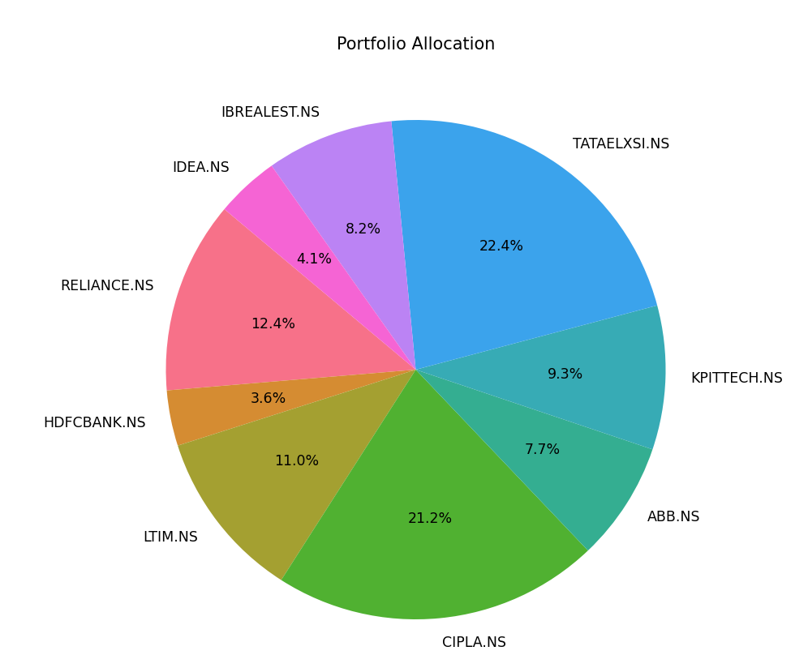
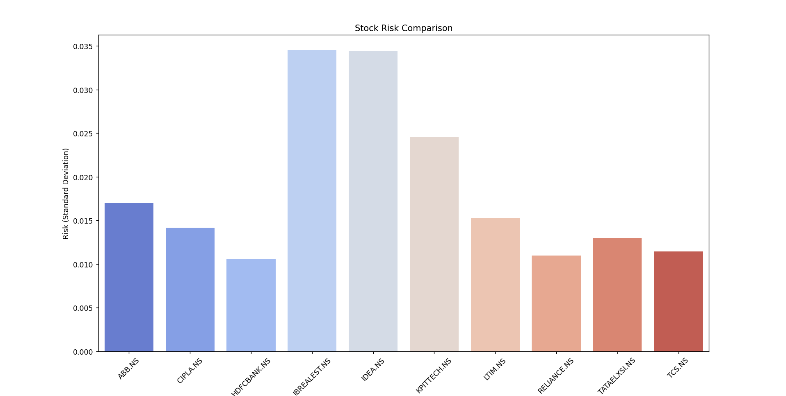
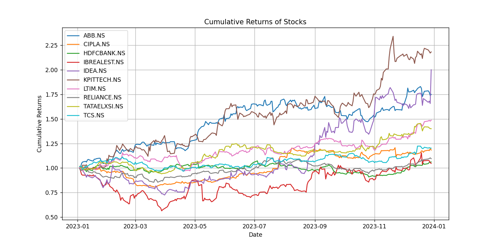
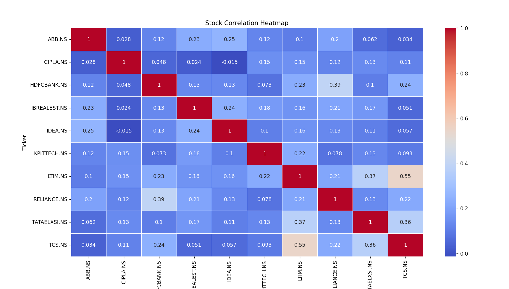
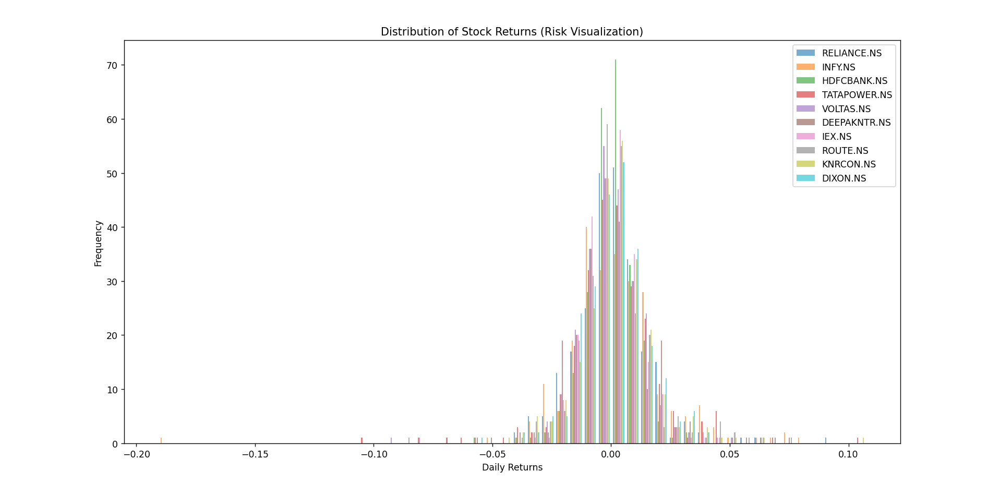
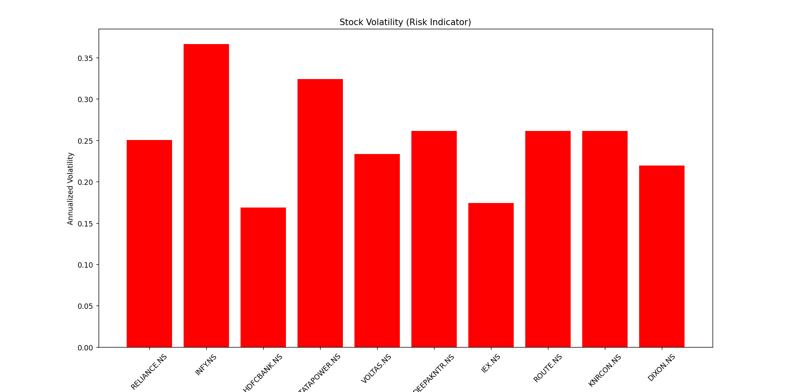
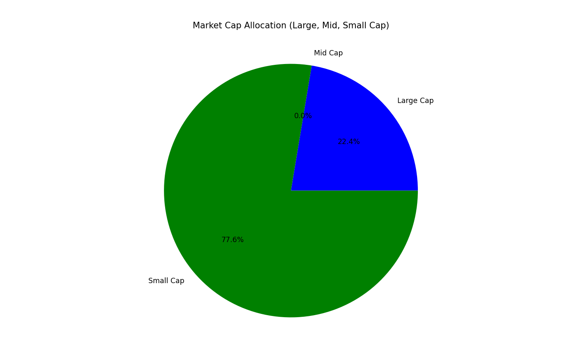

### **📊 AI-Powered Stock Analysis & Recommendation**

An AI-based stock analysis system that clusters stocks, evaluates risk, performs sentiment analysis on stock news, and recommends the best stocks based on risk and sentiment.

---

## 🚀 **Features**

✔️ **Stock Data Analysis** using Yahoo Finance 📈  
✔️ **Risk & Volatility Calculation** (Standard Deviation of Returns)  
✔️ **AI-Driven Clustering** using K-Means 🤖  
✔️ **Sentiment Analysis** of Stock News using TextBlob 📰  
✔️ **Real-time Sentiment Tracking & Alerts** 🚨  
✔️ **Visualizations** for Risk Allocation & Clustering 🎨

---

## 🛠 **Tech Stack**

- **Python** 🐍
- **Pandas** & **NumPy** for data handling 📊
- **yFinance** for stock market data 📈
- **Matplotlib & Seaborn** for visualizations 🎨
- **Scikit-learn** for clustering 🤖
- **TextBlob** for sentiment analysis 📰
- **Requests** for fetching stock news from APIs 🌍

---

## 📸 **Output Visualizations**

Generated visualizations are stored in the `output/` folder.

| 📊 Chart                              | 📸 Preview                            |
| ------------------------------------- | ------------------------------------- |
| **Risk Allocation Pie Chart** 🥧      |       |
| **Stock Clustering** 🔍               |      |
| **Stock Sentiment Analysis** 📰       |    |
| **Volatility Trends** 📈              |     |
| **Stock Returns Comparison** 🔄       |         |
| **AI Stock Recommendation** ✅        |  |
| **Real-time Sentiment Monitoring** ⏳ |    |

---

## 🔧 **How to Run**

1️⃣ **Clone the repo**

```sh
git clone https://github.com/your-username/your-repo.git
cd your-repo
```

2️⃣ **Install dependencies**

```sh
pip install -r requirements.txt
```

3️⃣ **Run the script**

```sh
python main.py
```
